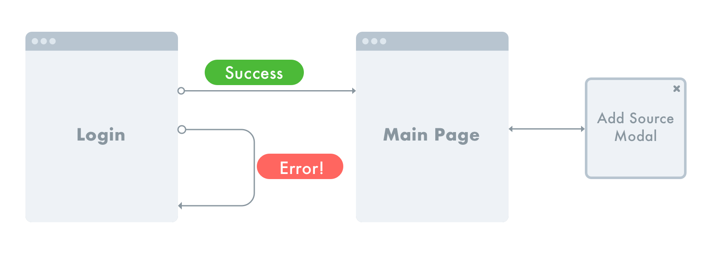

# Daily Bruin Sources Design Specification

## Overview

Daily Bruin Sources is a website that Daily Bruin reporters use to collect and
manage contact information about all sources they have.

## Users

Sources should only be used and acccessible to people within the Daily Bruin. We
ensure this is the case by requiring users to log in with their @media.ucla.edu
accounts (which are only accessible to members of UCLA Student Media). It's
important to note that @media.ucla.edu accounts are accessible to parts of
Student Media that aren't part of the Daily Bruin (e.g., UCLA Radio and the
newsmagazines), however, we think that the potential for malicious use by these
sister organizations is very unlikely.

## Screens

### Flowchart

### Screen-by-Screen Specifications

#### Login

The login page should be the page that anyone is redirected to if they are not
authenticated and try to access any page of Sources.

#### Main Screen
